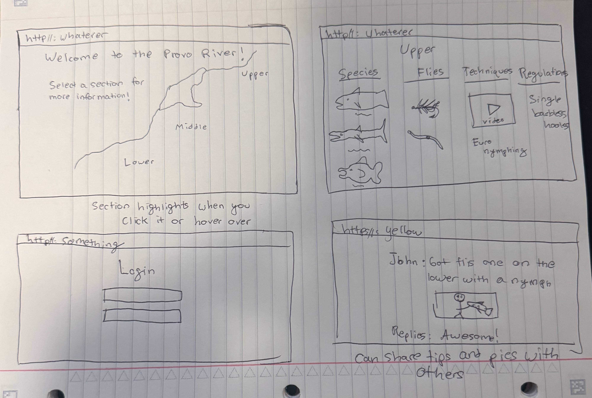

# Provo Fish Map

[My Notes](notes.md)

This app will assist fisherman on the who, what, when, where, how, and why of fishing the provo river and surrounding bodies of water. You will be able to click on an interactive map of the different sections of the provo river and it will give you direct info on what kind of fish live there and how to catch them.

## 🚀 Specification Deliverable

> [!NOTE]
>  Fill in this sections as the submission artifact for this deliverable. You can refer to this [example](https://github.com/webprogramming260/startup-example/blob/main/README.md) for inspiration.

For this deliverable I did the following. I checked the box `[x]` and added a description for things I completed.

- [x] Proper use of Markdown
- [x] A concise and compelling elevator pitch
- [x] Description of key features
- [x] Description of how you will use each technology
- [x] One or more rough sketches of your application. Images must be embedded in this file using Markdown image references.

### Elevator pitch

Have you ever moved to a new place or traveled to a far away land and wanted to dip your line in the water while you're there but don't know how to effectively target the local species? You then spent a significant amount of time trying to research online and even using chatgpt which gave you questionable answers. Then once you're out there you catch nothing and wonder why. This app will solve all of those issues. This is the one stop shop for fishing the Provo river where you can select on an interactive map where you would like to go fishing and it will give you all of the accurate info you need to have a successful day on the water such as location, fly selection, fishing technique, leader strength, and rod weight.

### Design

Here is a drawing of what the different pages will look like on the web app.

### Key features

- Interactive map of the river that you can click on
- Secure login to your account through HTTPS
- Info boxes with information on fish, flies, etc.
- Image posting to share your fish
- Commenting on posts
- Up to date information

### Technologies

I am going to use the required technologies in the following ways.

- **HTML** - Uses correct HTML structure for application. 4 HTML pages, the login page, the main page with the interactive map, the page that displays the information, and the page with the fish pictures.
- **CSS** - Application styling that looks good on different screen sizes, uses good whitespace, color choice and contrast. An interactive map that glows each section when you hover.
- **React** - Will handle the functionality of displaying pop ups and pages of info, as well as the logic behind the interactive river map.
- **Service** - Backend service with endpoints for login, posts, comments, etc.
- **DB/Login** - This will store peoples logins, posts, and comments.
- **WebSocket** - You will be able to communicate to others in real time through posting and commenting.

## 🚀 AWS deliverable

For this deliverable I did the following. I checked the box `[x]` and added a description for things I completed.

- [x] **Server deployed and accessible with custom domain name** - [My server link](https://startup.provofishmap.com/). Most of the notes on what I did are in my notes file. I succesfully deployed my web server which is physically in northen virginia. I assigned it an elastic IP and then attached that to my domain name provofishmap.com - I then ssh into the server from my laptop and used vi to edit the caddy file so the ports trying to be accessed will rerout to my website and will also use HTTPS so it is secure and it handles all that for me. So now you can go to my website securely and right now it only shows the content that was predownloaded from an AWS image I think. My next move will be to edit my startup html and push it into the server using a shell script written for me so that the website will display whatever I write and not what was preinstalled. 

## 🚀 HTML deliverable

For this deliverable I did the following. I checked the box `[x]` and added a description for things I completed.

- [x] **HTML pages** - I created 6 html pages: a home page, lower, middle, and upper provo river info pages, an about page, and a community page where you can post.
- [x] **Proper HTML element usage** - I used the proper elements and structure in each of my pages such as unordered lists, paragraphs, headers, sections, and divs.
- [x] **Links** - Each navigation button links to another of my html pages so they all work.
- [x] **Text** - I have text on every single page.
- [x] **3rd party API placeholder** - My picture in about is a placeholder I want it to show a random fish picture everytime.
- [x] **Images** - I have images on every page as well.
- [x] **Login placeholder** - I pulled the login from simon and put it on my home page.
- [x] **DB data placeholder** - I have a place for posting pictures and displaying your username.
- [x] **WebSocket placeholder** - When people post it should show up on everyones page.

## 🚀 CSS deliverable

For this deliverable I did the following. I checked the box `[x]` and added a description for things I completed.

- [x] **Header, footer, and main content body** - I styled the header and footer to be the same on every page and the main body for most has everything centered.
- [x] **Navigation elements** - I have navigation links at the top of every page and they look nice.
- [x] **Responsive to window resizing** - I used flex to make everything responsive.
- [x] **Application elements** - I styled the sections on each info page to look like cards so it is more organized, I did the same with the login feature and the posts, they all look like cards so it's organized.
- [x] **Application text content** - I made the font uniform with font and color for the whole website. 
- [x] **Application images** - I resized the images to fit properly and adapt to window sizing.

## 🚀 React part 1: Routing deliverable

For this deliverable I did the following. I checked the box `[x]` and added a description for things I completed.

- [x] **Bundled using Vite** - I used vite to bundle my react code so it turns into javascript on the website and makes a nice local website that constantly updates instead of live server.
- [x] **Components** - I created a component for each of my past pages so they aren't actually html pages anymore they are react components.
- [x] **Router** - I put the router in my main jsx file so it knows I have multiple views and will change it when it needs to instead of reloading the page everytime.

## 🚀 React part 2: Reactivity deliverable

For this deliverable I did the following. I checked the box `[x]` and added a description for things I completed.

- [x] **All functionality implemented or mocked out** - Yes I implimented functionality for my login page, it works but everything is saved locally so not fully functional yet. Same goes for my community page, you can post images and captions but nothing stays if you reload the page. Also the buttons on my map route to their respective pages. I also made every mouse click shoot little fish emojis out of it. 
- [x] **Hooks** - Yes I used all react hooks especially usestate, I used that for login authentication. I also used those for my posts on my community page. I used use effect for my fish click effects thing.

## 🚀 Service deliverable

For this deliverable I did the following. I checked the box `[x]` and added a description for things I completed.

- [x] **Node.js/Express HTTP service** - I created a backend express server that runs on port 4000 which is my index.js file.
- [x] **Static middleware for frontend** - Yes my express server now serves the react components when deployed.
- [x] **Calls to third party endpoints** - Yes it makes an http request to DummyJSON which gives me a random quote every time I open the about page.
- [x] **Backend service endpoints** - Yes I created 7 different endpoints that handle registration, login, logout, getting user info, viewing posts, creating posts, and deleting posts.
- [x] **Frontend calls service endpoints** - Yes I have many methods in my api file that are called by my login and community pages.
- [x] **Supports registration, login, logout, and restricted endpoint** - Yes users can now create an account and login and before you are logged in you can only access about page but once you are logged in you can access everything.

## 🚀 DB deliverable

For this deliverable I did the following. I checked the box `[x]` and added a description for things I completed.

- [x] **Stores data in MongoDB** - Yes I created a database file that stores all of the mongodb commands so those are used to store my data in my database instead of local storage.
- [x] **Stores credentials in MongoDB** - Yes I store the username and a hashed password using bcrypt so it is jumbled.
## 🚀 WebSocket deliverable

For this deliverable I did the following. I checked the box `[x]` and added a description for things I completed.

- [x] **Backend listens for WebSocket connection** - Yes in my index.js file I set it up to accept websocket connections by listening on port 9090.
- [x] **Frontend makes WebSocket connection** - Yes my react app connects to the websocket server and that is done in useWebsocket.jsx.
- [x] **Data sent over WebSocket connection** - Yes this happens in my backend in index.js it sends notifications to all connected clients. 
- [x] **WebSocket data displayed** - Yes the data recieved is actually shown on the screen because of useWebsocket.jsx and activityfeed.jsx.
- [x] **Application is fully functional** - Yes everything works as it should!
